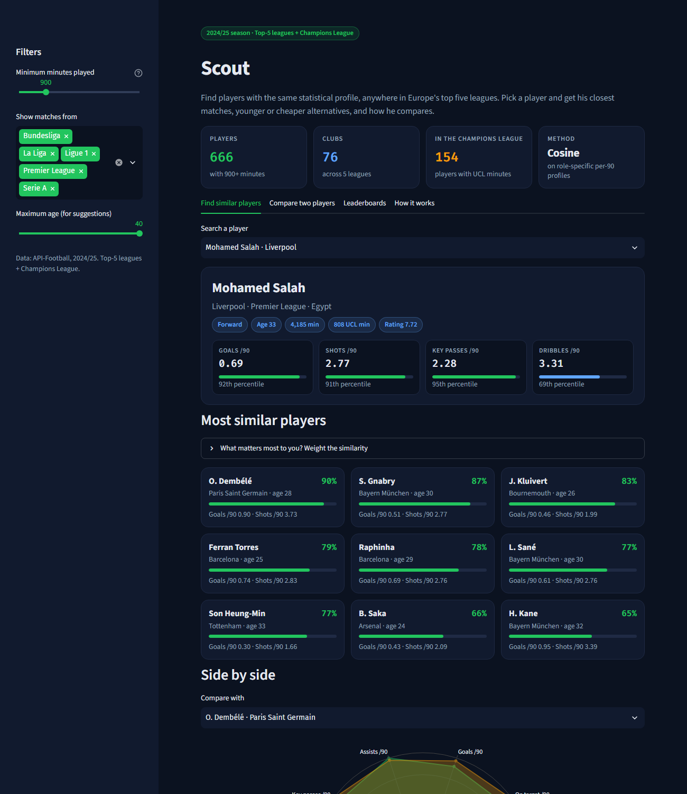
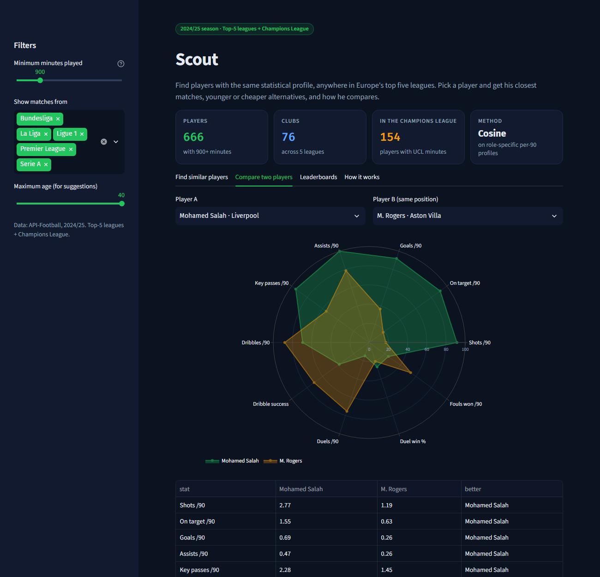
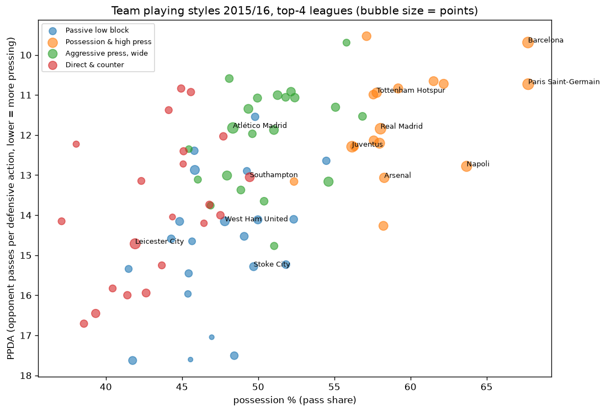

# Scout

Find footballers with a similar statistical profile. The idea is scouting by numbers: "who plays like Hakimi, but younger?"

### ▶ [Open the live app: football-scout-labs.streamlit.app](https://football-scout-labs.streamlit.app/)

Pick any player from the 2024/25 top-5 leagues or the Champions League:
- **Player card:** his percentiles.
- **Most similar players:** across Europe. You choose what matters (attacking, carrying the ball, defending), and can filter by league and age.
- **Head-to-head:** compare him with anyone else.

## How it works

- **Profile:** each player is described by role-specific **per-90-minute** stats, for example:
  - full-backs and centre-backs: tackles, interceptions, duels and win %, passing volume, key passes, dribbles (pass accuracy is left out: the source is missing it for most players);
  - forwards: shots, shots on target, goals, assists, dribbles and success rate, duels, fouls drawn.
- **Comparison:** stats are **standardised within the position**, and players are compared by **cosine similarity**, which measures the *shape* of the profile rather than raw volume.
- **Sample results:**
  - Hakimi → Maatsen, Alexander-Arnold, Pedro Porro;
  - Raphinha → Dembélé, Gnabry, Coman;
  - Salah → Dembélé, Gnabry, Kluivert.

## Also in this repo: the 2015/16 deep dive (StatsBomb event data)

`scouting/` contains the original project, built on every event of the 2015/16 Premier League, La Liga, Serie A and Ligue 1:
- **Player similarity on 37 event-level features:**
  - Kanté → **Idrissa Gueye**, whom Everton signed as Kanté's replacement in 2016;
  - Özil → David Silva.
- **Unsupervised role discovery:** 8 roles found without position labels.
- **Team playing-style clusters:** Leicester won the 2015/16 title with the "Direct & counter" style, which averages 43.5 points.

## Data

- **2024/25 app:** [API-Football](https://www.api-football.com) player season stats, downloaded within the free plan. API-Football doesn't allow redistributing its data, so the data file is **not** in this repository; the deployed app reads it from private storage. `players_2425.parquet` is built by a separate (private) download job.
- **2015/16 analyses:** [StatsBomb Open Data](https://github.com/statsbomb/open-data). Run `python statsbomb.py`, then `python scouting/build.py`, `scouting/players.py` and `scouting/teams.py`.

Why 2024/25 and not the current season? In 2026, free access to current-season player data for these leagues isn't available from any source that permits automated use. API-Football's free plan covers 2022/23–2024/25.
